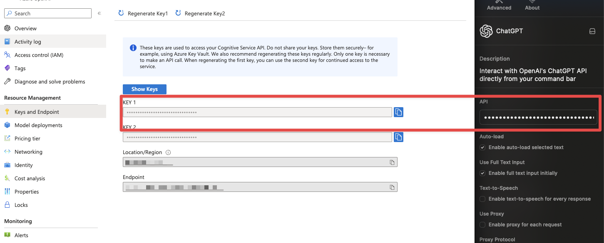
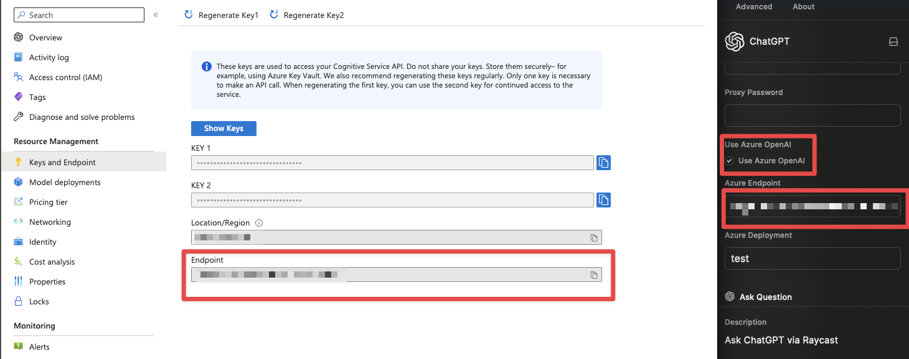
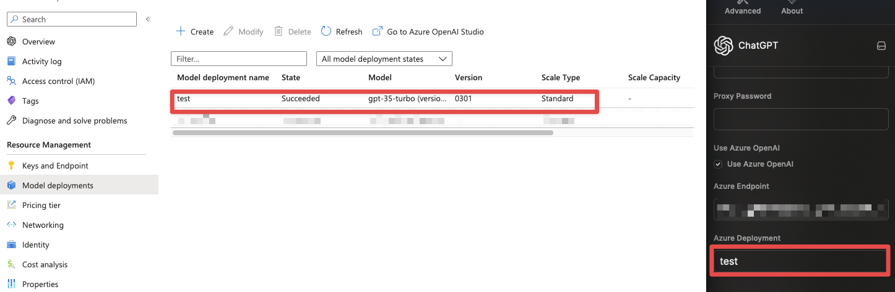

<h1 align="center">ChatGPT</h1>

<h3 align="center">
Interact with OpenAI's ChatGPT right from your command bar
</h3>

<a href="https://github.com/raycast/extensions/tree/main/extensions/chatgpt" title="ChatGPT Raycast extension latest source code">Latest source code
</a>

# Features

### Ask anything, from your favourite thing

Straight from your command bar, ask anything that you wanted and get an AI-generated answer without any effort.

### Personalized for you, really

Customize the model to your liking. Create and edit custom engines beyond your creativity.

### Keep continue, with you

Continue talking about everything right where you left off. Be pro without from zero.

### Save the answer, for later

Got the answer that you wanted? Great. Now you can save it without asking again.

### Look-up your past, fast

Automatically save all the question and answer so you can go back digging for the answer you're looking, quickly.

# Models availability

### GPT-3.5

- `gpt-3.5-turbo`
- `gpt-3.5-turbo-0301`

### GPT-4

GPT-4 model availability depends on your developer account. You need access to the GPT-4 API key through OpenAI's waitlist from [here](https://openai.com/waitlist/gpt-4-api) to see the GPT-4 model option.

# How to use

This package requires a valid `Secret Key` from [OpenAI](https://platform.openai.com/account/api-keys) with a `pay-as-you-go` plan account (**you'll get a `429` error if you're on a `free-tier` account**).

## How to use Azure OpenAI

1. Copy your Azure OpenAI Key and as API key.

1. Copy your Azure OpenAI Endpoint and as Azure Endpoint. Also check the `Use Azure OpenAI` checkbox.

1. COpy your Azure OpenAI Deployment and as Azure Deployment Name.

> All the preferences value will be stored locally using [Preferences API](https://developers.raycast.com/api-reference/preferences)

# Preferences

All preferences properties list that can be customize through `Raycast Settings > Extensions > ChatGPT`

| Properties               | Label                  | Value                               | Required | Default | Description                                                                                                      |
| ------------------------ | ---------------------- | ----------------------------------- | -------- | ------- | ---------------------------------------------------------------------------------------------------------------- |
| `api`                    | API                    | `string`                            | `true`   | `empty` | Your personal Open AI API key                                                                                    |
| `useStream`              | Stream Completion      | `boolean`                           | `true`   | `true`  | Stream the completions of the generated answer                                                                   |
| `isAutoSaveConversation` | Auto-save Conversation | `boolean`                           | `true`   | `true`  | Auto-save every conversation that you had with the model                                                         |
| `isAutoLoadText`         | Auto-load              | `boolean`                           | `false`  | `false` | Load selected text from your frontmost application to the `question bar` or `full text input form` automatically |
| `isAutoFullInput`        | Use Full Text Input    | `boolean`                           | `false`  | `false` | Switch to `full text input form` from `question bar` automatically whenever you want to ask or type a question   |
| `isAutoTTS`              | Text-to-Speech         | `boolean`                           | `false`  | `false` | Enable auto text-to-speech everytime you get a generated answer                                                  |
| `useProxy`               | Use Proxy              | `boolean`                           | `false`  | `false` | Each question request will be passed through the proxy                                                           |
| `proxyProtocol`          | Proxy Protocol         | `http`, `https`, `socks4`, `socks5` | `false`  | `http`  | Proxy protocol option                                                                                            |
| `proxyHost`              | Proxy Host             | `string`                            | `false`  | `empty` | Proxy host value                                                                                                 |
| `proxyUsername`          | Proxy Username         | `string`                            | `false`  | `empty` | Proxy username value                                                                                             |
| `proxyPassword`          | Proxy Password         | `string`                            | `false`  | `empty` | Proxy password value                                                                                             |
| `useAzure`               | Use Azure OpenAI       | `boolean`                           | `true`   | `false` | Use Azure OPENAI rather than OPENAI                                                                               |
| `azureEndpoint`          | Azure OPENAI endpoint  | `string`                            | `false`  | `empty` | Azure OPENAI resource endpoint                                                                                    |
| `azureDeploymentName`    | Azure OPENAI deplyment | `string`                            | `false`  | `empty` | Azure OPENAI resource deplyment                                                                                   |

---

Made with ♥ from Indonesia

